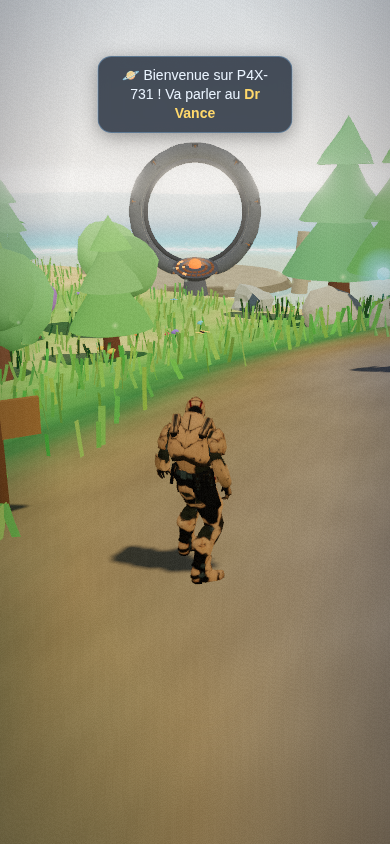
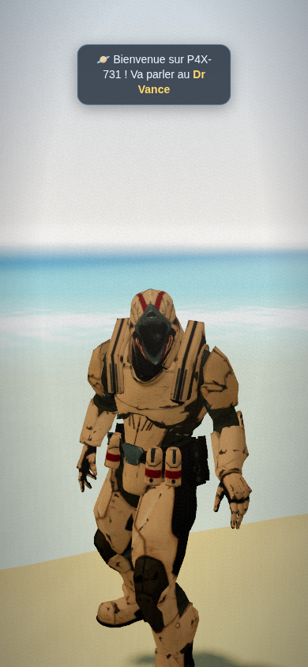

# 🌀 La Porte Oubliée

Un jeu d'aventure 3D **mobile-first** dans l'univers de Stargate, en [three.js](https://threejs.org/), sans build, sans dépendance externe : ouvre `index.html` et joue.

> *Fan game non officiel et non commercial. Stargate SG-1 / Atlantis / Universe sont des marques de MGM/Amazon — tous les visuels de ce jeu sont générés procéduralement, aucun asset des séries n'est utilisé.*

| Vers la Porte | Le rivage de P4X-731 |
|---|---|
|  |  |

## 🎮 L'histoire

**Acte 1.** Ton vaisseau s'est écrasé sur **P4X-731**. Le **Dr Vance**, archéologue du SGC, est coincé : la tempête de naquadah a grillé le **DHD** et éjecté ses **5 cristaux de contrôle** (lueur orange, piliers de lumière). Retrouve-les, répare le DHD, puis pose la main sur le dôme : la **séquence de composition** s'enclenche — chevrons un à un, kawoosh, horizon des événements.

**Acte 2 — Les Réplicateurs.** Un vortex entrant instable laisse passer une **nuée de Réplicateurs** avant fermeture. Une nuit artificielle tombe sur la planète. Prends la **lame ancienne**, réactive les **4 obélisques de défense lantiens** (5 ❤️, tu réapparais au campement si tu tombes), détruis le **Réplicateur Alpha**… puis **franchis toi-même l'horizon des événements** pour rentrer sur Terre — traversée du vortex incluse.

## 📱 Contrôles

| Plateforme | Déplacement | Caméra | Action | Attaque |
|---|---|---|---|---|
| **Mobile** | joystick virtuel (pouce gauche) | glisser sur la moitié droite | bouton contextuel 💬 / 🖐 / ⚡ | bouton ⚔️ |
| **Desktop** | ZQSD / WASD / flèches | clic-glisser | `E`, `Espace` ou `Entrée` | `F` |

## 💾 Sauvegarde

La progression est **sauvegardée automatiquement** (localStorage) à chaque étape : cristaux du DHD, DHD réparé, obélisques réactivés, boss. Au retour, un bouton **« ▶ Reprendre la mission »** reprend la partie là où tu l'as laissée.

## 🚀 Lancer le jeu

Le jeu utilise des modules ES, il faut donc le servir en HTTP (pas de `file://`) :

```bash
# n'importe quel serveur statique fait l'affaire
python3 -m http.server 8000
# puis ouvrir http://localhost:8000
```

Ou active simplement **GitHub Pages** sur ce dépôt (Settings → Pages → branche) : aucune étape de build n'est nécessaire.

## 🛠️ Sous le capot

- **Personnages 3D animés** : soldat glTF riggé (animations squelettiques Idle/Marche/Course fondues selon la vitesse, lame attachée à l'os de la main droite, coup d'épée par surcouche d'os) pour le joueur et le Dr Vance, oiseaux alien animés qui tournoient, et **Réplicateurs robots animés** (marche, course, coup de poing quand ils frappent, vraie animation de mort) — modèles d'exemple du dépôt three.js (licence MIT), convertis au cel-shading du jeu, avec repli automatique sur les personnages procéduraux si le chargement échoue.
- **Le reste est 100 % généré** : three.js vendorisé (`js/vendor/`), sons synthétisés en WebAudio, textures (halos, glyphes, lune, planète) générées en canvas.
- **Île procédurale** : terrain dense (35 000+ triangles) déformé par bruit sinusoïdal, colorié par altitude, océan, nuages animés, lucioles.
- **Assets sculptés** : un système de sculpture procédurale (déplacement multi-octaves le long des normales) donne des rochers anguleux en 4 variantes, des canopées bosselées, des feuillages froissés, des cristaux aux facettes irrégulières — chaque polygone ajouté est visible.
- **Bibliothèque glTF** : chaque asset héros est exporté en `.glb` autonome dans `assets/library/` (Porte, DHD, obélisque, cristal, rocher), réutilisable dans Blender ou tout moteur.
- **Direction artistique cel-shading** : tous les matériaux du monde passent par une rampe de lumière toon (bandes douces façon BOTW/Ghibli), avec rim light sur les personnages, vent en vertex shader sur la végétation et grain procédural sur la pierre.
- **6 000 brins d'herbe instanciés** qui ondulent dans le vent, feuilles portées par la brise, papillons le jour, étoiles filantes la nuit.
- **Pipeline HDR** : rendu half-float multisamplé, bloom (UnrealBloom), tone mapping ACES, **grain de film + micro-saturation** en post ; lumières dynamiques ; crépuscule embrasé pendant la transition jour/nuit ; grading doré harmonisé (ciel crème, soleil chaud, brouillard chaud).
- **Océan artistique** : houle directionnelle amortie au rivage, **ligne d'écume organique qui avance et se retire** en léchant la plage (dissolution par bruit), traînées d'écume, crêtes moutonnantes au large, **chemin de soleil scintillant** orienté vers l'astre, dégradé turquoise → lagon → abysse, transparence sur le sable.
- **Caméra anti-occlusion** : la caméra se rapproche automatiquement quand un arbre ou un rocher bloque la ligne de vue (comme dans les jeux third-person), et ne traverse jamais le sol.
- **Perf mobile** : `InstancedMesh` massif, pixel ratio plafonné à 2, une seule lumière à ombres (2048²) qui suit le joueur, brouillard pour limiter la draw distance.
- **Gameplay** : machine à états de quête (8 étapes sur 2 actes), dialogues, collisions par cercles, caméra 3ᵉ personne avec orbite tactile, particules de collecte/combat/victoire.
- **La Porte des Étoiles** : anneau en naqahdah **sculpté par déplacement de sommets** (surface martelée haute densité), bande de 39 glyphes générés en canvas avec séparateurs, 9 chevrons détaillés en V qui s'enclenchent, **horizon des événements animé en shader** (la « flaque »), kawoosh en particules, DHD au dôme orange avec ses **39 touches à glyphes** sur deux couronnes ; séquence de composition scriptée.
- **Acte 2** : cycle jour → nuit interpolé, entités d'énergie avec IA de poursuite, combat à la lame ancienne (frappe multi-os torse/bras/avant-bras + traînée d'énergie), obélisques lantiens à énergie bleue, boss à 6 points de vie, réouverture de la Porte et traversée du vortex. Planète alien : deux lunes, planète géante à l'horizon, végétation turquoise et pourpre.
- **Tactile soigné** : joystick dynamique (apparaît sous le pouce), multi-touch (marcher + tourner la caméra en même temps), `safe-area-inset` pour les encoches, blocage du zoom/scroll.

## 📂 Structure

```
index.html            # page, HUD, styles, import map
js/main.js            # tout le jeu (commenté)
js/vendor/            # three.js r160 + post-processing + loaders glTF
assets/models/        # Soldier.glb, Parrot.glb, RobotExpressive.glb (three.js, MIT)
assets/library/       # les assets héros du jeu exportés en .glb
```

Amuse-toi bien ! ⛵
